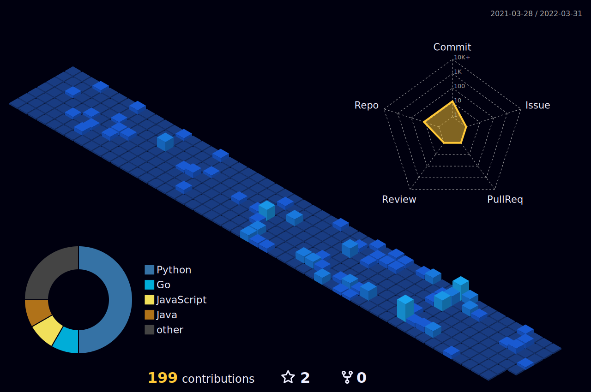

  

<h1> Hey there < coders/ >!  </h1>

</img>

 

&nbsp;&nbsp;&nbsp;&nbsp;

 

## Github Contribution Streak 🔥 

 

 

## Github Stats &nbsp;📊
 

 

## Most Used Languages 📚
 

<h6>Note : Does not indicate my skill level or anything like that, it's a GitHub metric of which languages have the most code on GitHub.</h6>

 

## 3D Contribution Calendar 📅
 

 

## Technology Stack 💻

</img>

### Programming Languages 👨‍💻 :
 

&nbsp;&nbsp;
&nbsp;&nbsp;
&nbsp;&nbsp;
&nbsp;&nbsp;
&nbsp;&nbsp;
&nbsp;&nbsp;

 

### Database 💾 :
 

 

### Web Development 🌐 :
 

&nbsp;&nbsp;
&nbsp;&nbsp;

 

### Frameworks & Libraries 📦 :
 

&nbsp;&nbsp;
&nbsp;&nbsp;
&nbsp;&nbsp;
&nbsp;&nbsp;
&nbsp;&nbsp;
&nbsp;&nbsp;

 
### Hosting/SaaS 🎈:
 

&nbsp;&nbsp;
&nbsp;&nbsp;

 

### Design 🎨 :
 

&nbsp;&nbsp;

 

### IDEs/Editors 👨‍🔧 :
 

&nbsp;&nbsp;
&nbsp;&nbsp;
&nbsp;&nbsp;

 

### Version Control 🔧 :
 

&nbsp;&nbsp;
&nbsp;&nbsp;

 

### IOT 🔌 :
 

</img>

 

 

### Operating Systems 🐧 :
 

</img>

 

&nbsp;&nbsp;
&nbsp;&nbsp;
&nbsp;&nbsp;
&nbsp;&nbsp;

 

## Github Contributions 📈
 

 
## Trophies 🏆:
 

 

## Dynamic Quotes 📜:
 

 

</img>

 

<h2 align='center'>Thank You!!!!!</h2>
 

  

